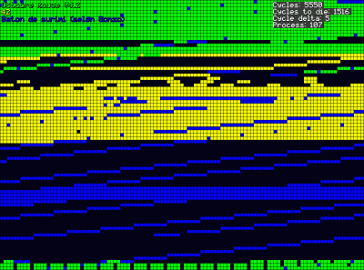

Corewar
=======

A battle of programs in a virtual machine.

This corewar is a first year project of an IT school (Epitech). See "corewar_en.pdf"

Compilation
-----------
~~~bash
$ make
~~~

Usage
-----
~~~bash
$ cd corewar
$ ./corewar -h
Usage: ./corewar [-dump numbers_of_cycles] [ [-a load_address] champion1.cor] ...
$ ./corewar champs/Octobre_Rouge_V4.2.cor champs/42.cor champs/raid_aerien.cor
~~~

There is also an asm in its eponym directory. Useful to make your own champion !

